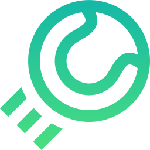

<p align="center">
  
</p>

<h1 align="center">Hazz Tennis Performance</h1>

<p align="center">A web-based software system that keeps track of all tennis operations, client’s information and coaching activities.</p>

## Stack

- Next.js `11.x`
- React `17.x`
- Tailwind CSS `2.x`

## Requirements

- Node.js `14.x`

## Getting started

1. Install Node.js dependencies:

```sh
yarn
```

## Development

**Start the local development server**

```sh
yarn dev
```

Open [http://localhost:3000](http://localhost:3000) in your browser.

## Credits

Logo made by [Freepik](https://www.freepik.com) from [www.flaticon.com](https://www.flaticon.com)
